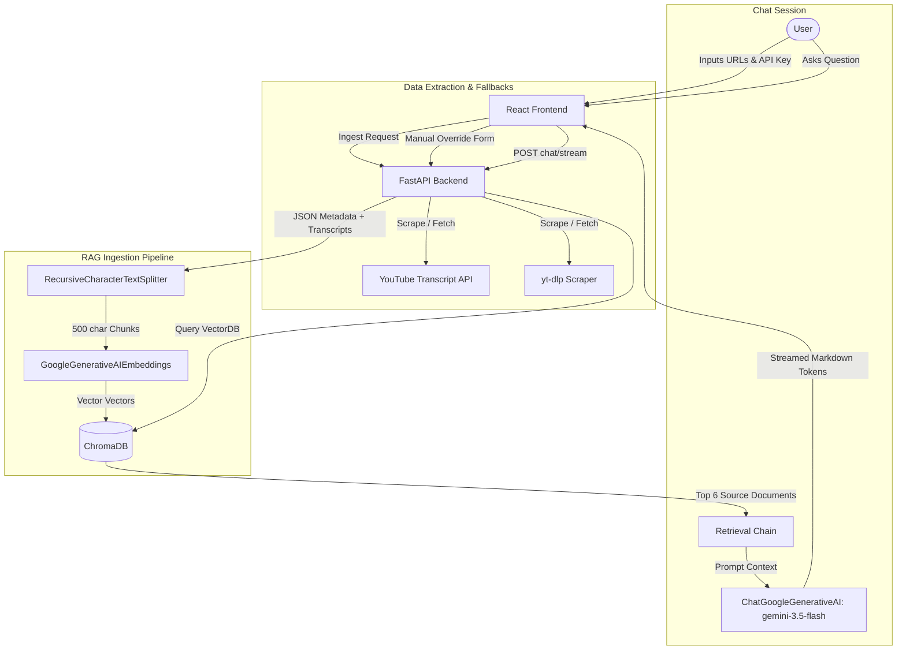

# 🎬 Video RAG Analyst: AI-Powered Comparison & Insights

A full-stack RAG (Retrieval-Augmented Generation) chatbot application designed to ingest, analyze, and compare two social media videos (YouTube and Instagram) using LangChain, ChromaDB, and Gemini AI. The application features real-time streaming responses, conversational memory, source citation, and custom metadata overrides.

---

## 📌 Executive Summary (For Executives & Higher Officials)

In the modern digital landscape, content creators, marketing agencies, and brand managers must analyze cross-platform content performance. **Video RAG Analyst** bridges the gap between raw video data and actionable insights.

### Value Proposition
* **Cross-Platform Analytics:** Directly compares metrics and transcripts from YouTube and Instagram Reels.
* **Semantic Analysis:** Leverages LLMs to compare hooks, messaging structures, scripting, and pacing.
* **Low-Cost Scale:** Built on a highly optimized, serverless-ready Python and React stack, dramatically minimizing token usage and hosting costs.
* **High Security:** Runs locally, allowing developers and companies to maintain full control of their credentials and keys.

---

## 📐 System Architecture

Below is the high-level architecture showing how data flows from URLs to vectorized documents and conversational responses:



---

## 👥 Audience Guides

To ensure this guide is useful to everyone, please select the section matching your role:

---

### 👤 End User Guide
*Perfect for content creators, brand managers, and social media managers.*

#### How to use the application:
1. **Get your Gemini API Key:** Go to [Google AI Studio](https://aistudio.google.com) and get a free API key. Paste this key into the **Gemini API Key** field in the UI.
2. **Enter Video URLs:**
   * **Video A (YouTube):** Paste any YouTube Shorts or standard video link.
   * **Video B (Instagram Reel):** Paste an Instagram Reel link.
3. **Analyze:** Click **Analyze Videos**.
4. **Chat & Compare:** Once loaded, ask questions in the chat! (e.g., *"Which video had the hook that grabbed attention faster?"* or click one of the suggested chips).

> [!IMPORTANT]
> **Instagram Scrape Failure & Manual Editing:**
> Instagram actively blocks anonymous automated scrapers (using a login wall). If this happens:
> 1. You will see a warning badge on the Instagram video card: *"⚠️ Could not fetch Instagram data automatically."*
> 2. Click the **"✏️ Edit Video Data"** button.
> 3. Enter the video title, creator username, views, likes, comments, and paste the description/script/transcript.
> 4. Save and click **"Analyze Videos"** again. The RAG chatbot will index your manual details and analyze the video perfectly!

---

### 💻 Developer Guide
*Perfect for full-stack developers and software engineers.*

#### Local Repository Structure
* `/backend/`: FastAPI server files.
  * [main.py](file:///c:/projects/rag-chatbot/backend/main.py): REST endpoints, CORS configurations, and thread-executor task management.
  * [rag_engine.py](file:///c:/projects/rag-chatbot/backend/rag_engine.py): LangChain RAG pipeline, embeddings setup, LLM streams, and session memory.
  * [video_fetcher.py](file:///c:/projects/rag-chatbot/backend/video_fetcher.py): Metadata and transcript scrapers using `yt-dlp` and `youtube-transcript-api`.
* `/frontend/`: React single-page application.
  * [src/App.js](file:///c:/projects/rag-chatbot/frontend/src/App.js): App layout, manual override modal, WebSocket-like HTTP streaming reader, and states.
  * [src/App.css](file:///c:/projects/rag-chatbot/frontend/src/App.css): Curated dark-mode theme, glassmorphic layout, hover micro-animations, and animations.

#### Key Code Patterns: Bypassing gRPC `SecretStr` Type Issues
In LangChain, passing the API key to `google_api_key` in the constructor coerces it into a Pydantic `SecretStr`. However, the underlying gRPC metadata authentication plugin in the `google-generativeai` SDK strictly expects a raw `str` and crashes.
* **The Solution:** Avoid passing the key to constructors. Instead, configure it in `os.environ`:
```python
os.environ["GOOGLE_API_KEY"] = api_key
embeddings = GoogleGenerativeAIEmbeddings(
    model="models/gemini-embedding-001",
    task_type="retrieval_document"
)
```

---

### 💼 Client / Project Sponsor Guide
*Perfect for stakeholders analyzing costs, scaling, and feasibility.*

#### Cost-Efficiency Review
* **AI Model Costs:** By utilizing `gemini-3.5-flash` instead of models like GPT-4o, input costs drop from **$5.00/1M tokens** to **$0.075/1M tokens** (a **66x saving**), while maintaining support for large context windows.
* **Zero Database Infra Costs:** Using local ChromaDB saves thousands of dollars annually in database infrastructure.
* **Free Scraping:** Using open APIs instead of paid scraping APIs minimizes external API dependency.

#### Production Scalability Path
To scale the application to handle **1,000+ creators per day**:
1. **Persistent Vector Store:** Replace in-memory ChromaDB with a cloud-managed vector database like **Qdrant Cloud** (free tier supports up to 1GB vectors) or **Pinecone Serverless** (costing ~$0.001 per query).
2. **Reliable Metrics:** Replace yt-dlp metadata calls with official APIs (YouTube Data API v3) and official platforms for Instagram Graph API to guarantee 100% scrape rates at scale.

---

### 🎓 Student Guide
*Perfect for learners studying RAG pipelines, LLMs, and Python FastAPI.*

#### Key Concepts to Learn from This Codebase:
1. **RAG (Retrieval-Augmented Generation):** How we chunk text, embed it using vectors, retrieve matching documents via similarity searches, and prompt the LLM using context documents.
2. **Chunking Strategies:** Why we split text into **500-character chunks** with a **50-character overlap**. (500 chars represents roughly 4-5 sentences, providing enough context without exceeding embedding limits; overlap prevents loss of context at boundaries).
3. **Conversational Memory:** How `RunnableWithMessageHistory` associates the user session UUID with chat history stored in memory to retain context.
4. **Asynchronous Task Offloading:** How FastAPI offloads heavy CPU/Network-bound tasks (like `yt-dlp` scraping and vector creation) to a thread pool executor using `loop.run_in_executor` so that the event loop remains unblocked.

---

## 🚀 Setup & Local Installation

### Prerequisites
* **Python 3.10+**
* **Node.js 18+**
* A free Gemini API Key from [Google AI Studio](https://aistudio.google.com).

### 1. Backend Setup
Navigate to the backend folder, install dependencies, and create environment configuration:
```bash
cd backend
pip install -r requirements.txt
cp .env.example .env
```
Edit the newly created `.env` file to set:
```env
GEMINI_API_KEY=your_gemini_api_key_here
SERVER_PORT=8000
SERVER_HOST=127.0.0.1
```
Start the backend development server:
```bash
python -m uvicorn main:app --reload --host 127.0.0.1 --port 8000
```

### 2. Frontend Setup
Open a new terminal, navigate to the frontend folder, and install node packages:
```bash
cd frontend
npm install
```
Start the React application:
```bash
npm start
```
The application will open in your browser automatically at `http://localhost:3000`.

---

## 🛠️ API Endpoints

| Method | Endpoint | Description |
| :--- | :--- | :--- |
| `POST` | `/ingest` | Triggers fetching from URLs (or loads custom payloads), embeds text, and loads into ChromaDB. |
| `POST` | `/chat/stream` | Streams markdown RAG responses based on similarity search match. |
| `POST` | `/chat/sources` | Returns the sources referenced during retrieval. |
| `GET` | `/videos` | Gets the active metadata for the loaded videos. |
| `GET` | `/session/new` | Creates a new session ID for the conversational window. |
| `DELETE` | `/session/{id}` | Clears conversation memory for a given session. |
